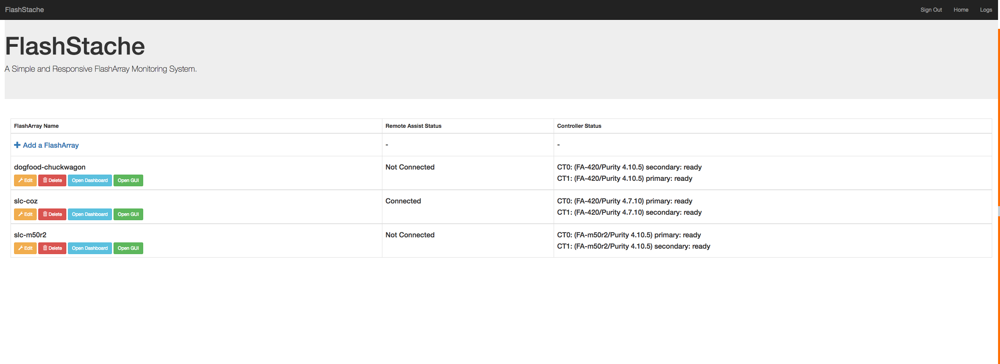
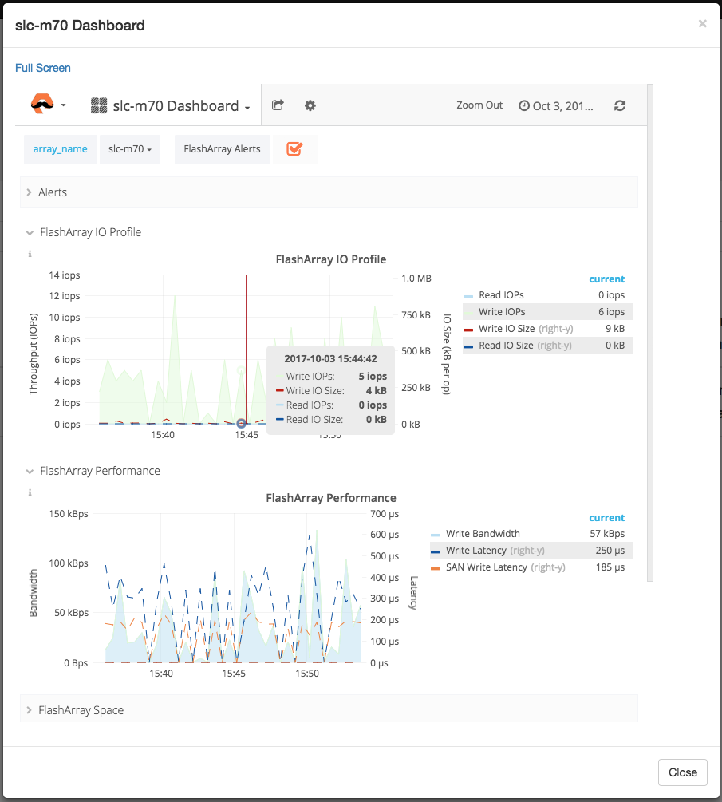

# FlashStache

FlashStache is a front end for data collection from flash arrays into databases for use in grafana.  For more information about using grafana once the server is configured, please see https://grafana.com/.  FlashStache is a webserver front end for automating python scripts that leverage the REST API to collect datapoints from the flasharray, and saves them to a database that can be accessed by grafana.  The automation includes scheduling how often data is collected from the flasharray, which flasharrays to collect data from, and links to the flasharray GUI and grafana dashboards.  FlashStache also populates a default dashboard for each flasharray for an immediate and basic functionality within grafana.

FlashStache should not be considered a substitude for learning and using grafana - it is designed to simplify data collection, and provide a single location for starting, modifying, and stopping that datacollection.  For CentOS deployments, a CentOS OVA has been built, and can be found at: https://purestorage.box.com/s/zqaojdy1e4f18lbim4lolpskdkt9vhsj.  

# Demonstration Video and iPython Notebook
https://purestorage.app.box.com/folder/47026827834

### Default Logins for CentOS OVA:
CentOS root: flashstache/flash

FlashStache: flashstache/flashstache

Grafana:     admin/flashstache

### Without FlashStache:
1. Setup database
2. Setup grafana server
3. script data collection via REST API and save to database
4. Set up grafana dashboards for arrays
5. Maintain and modify scripting for changes in arrays/monitoring needs
5. Use grafana with flasharray data

### With FlashStache:
1. Run setup.sh
2. Use grafana with flasharray data

Note:

* FlashStache Comes with several template dashboards
* Additional dashboards can be created in Grafana
* To start required services run start.sh
    * MySQL/Django/Grafana will start on boot

# Recommendations:

* 4+ CPU Cores
* 4+ GB of RAM
* 5+ GB of storage per FlashArray (per 24 hours of retention)
* For the IP Address, use a virtual interface (such as vir0)
* For the API Token, use read-only user (Pure Storage read-only AD group)

# Future:

* Scale out workers to support more arrays (tested with up to 10)
* Scale out database/webserver/logging/etc. for better performance
* Improved User Authentication/security (currently only has an admin user)
* Simplify new dashboard template importing
* Additional dashboards (pre-built) upon request
* Automate redis workers spawning on reboot
    * Possibly change to use Celery w/ Supervisor

# Installation (Ubuntu 16.04):

* Clone/pull the repository
`git clone https://github.com/PureStorage-OpenConnect/FlashStache.git`
* Run the setup.sh
`cd FlashStache/`
`sudo -H ./setup.sh`
* Navigate to the host IP address
* Add FlashArrays for monitoring

# Example:

